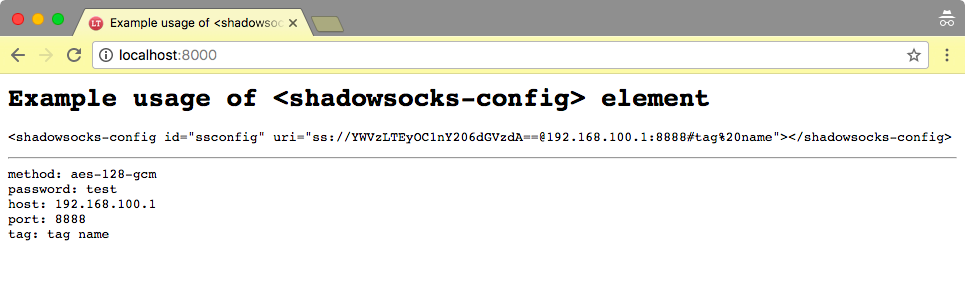
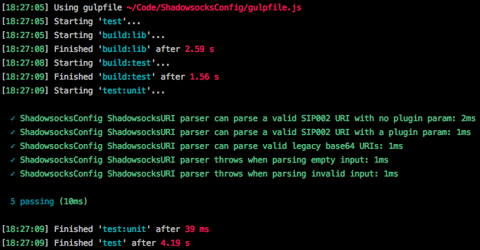

# ShadowsocksConfig

[](https://travis-ci.org/uProxy/ShadowsocksConfig)

This library abstracts parsing, validation, and user presentation
of Shadowsocks configuration URIs.
It is written in TypeScript and can be imported as a WebComponent,
included directly from the browser,
or imported as a CommonJS node module.

### WebComponent

See `index.html` for example usage.



### Common JS (Node)

```javascript
const parse = require('ShadowsocksConfig').ShadowsocksURI.parse;
parse('ss://...')
```

### TypeScript

```typescript
/// <reference path="../node_modules/ShadowsocksConfig/ShadowsocksConfig.ts" />
```

```javascript
import * as ssconfig from 'ShadowsocksConfig';
```

## Development

The Gulpfile itself is written in TypeScript.
You can run the npm script `gulp` to compile and run it on the fly:

```sh
npm run gulp
```

### Unit Tests

```sh
npm run test
```


